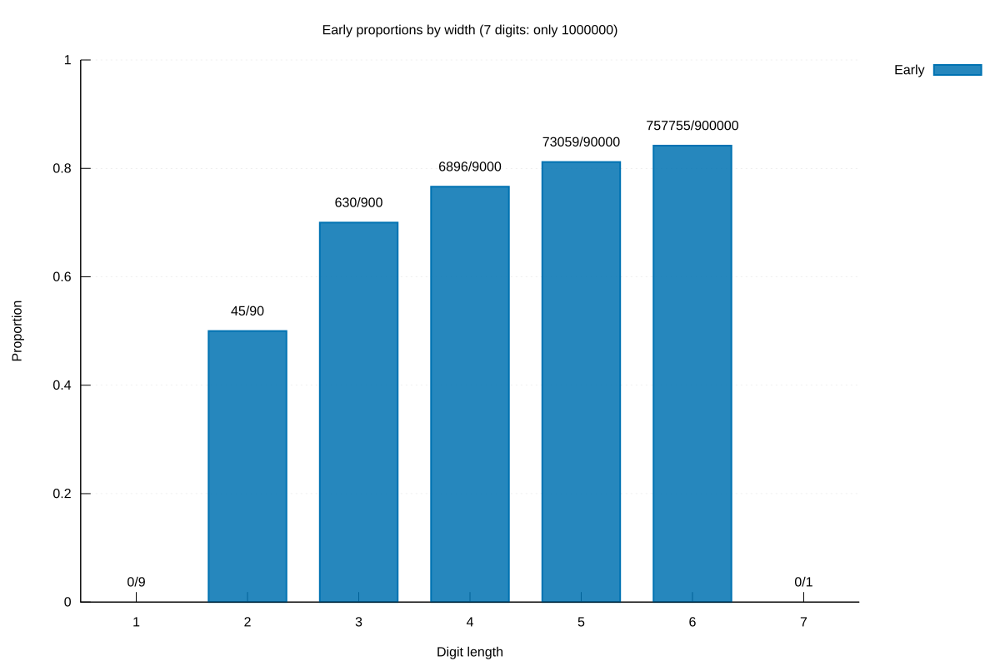
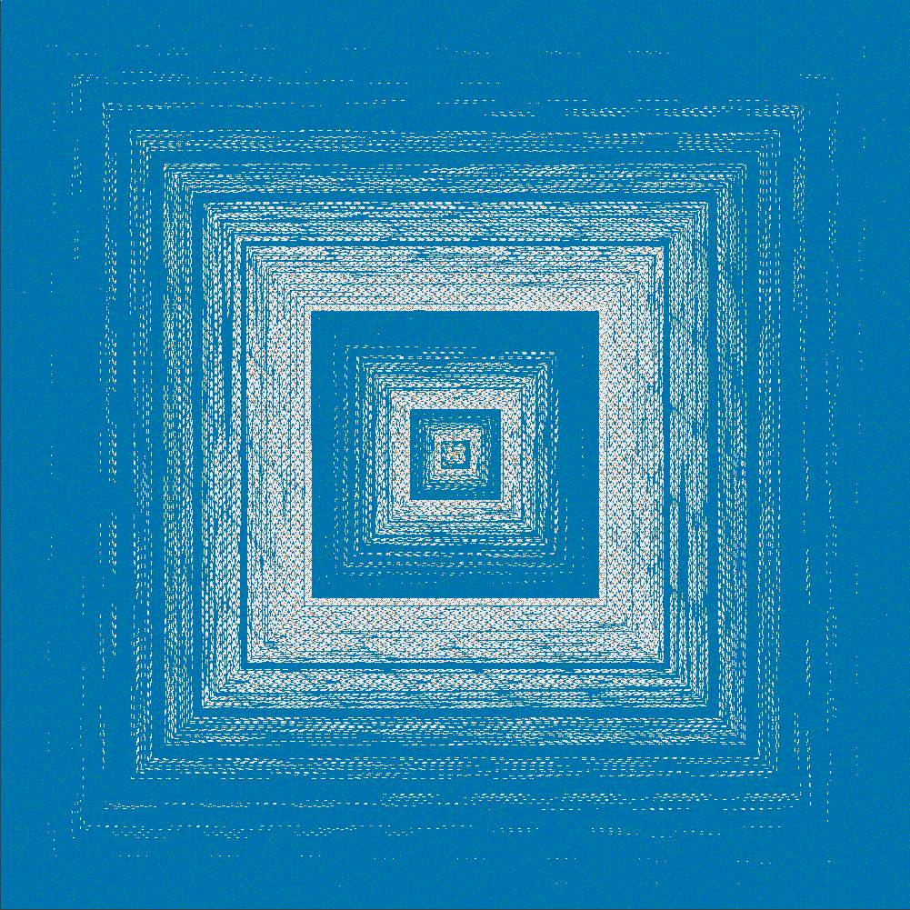

# Mahler Project

[Türkçe](README.tr.md)

A C++20 mathematical research project for the decimal Champernowne constant, also known as Mahler's number:

```text
0.123456789101112131415...
```

The C++ program provides direct digit lookup, early-bird searches, reproducible CSV/JSON exports, mathematical analyses, and Ulam figures for targets through 1,000,000.

## Current capabilities

- Find any digit at a positive `uint64_t` position without constructing preceding digits.
- Locate its source integer and zero-based digit offset through JSON output.
- Find a positive integer's natural starting position, with checked overflow.
- Generate bounded prefixes through the C++ library for subsequent validation and scanning.
- Produce text or JSON query output.
- Compute first occurrence, early-bird status, early frequency, and advance distance with `early`.
- Cross-check numeric-window scanning against an independent per-target reconstruction engine.
- Export target summaries, optional early occurrence records, and a run manifest with checksums.
- Measure both engines without including file output in core timing.
- Analyze frequencies, special number sets, source-boundary mechanisms, rotation certificates, and finite digit blocks.

- Generate seven Ulam layers as small SVGs or optional libpng PNGs.
- Produce bilingual statistical SVG/PNG/PDF charts with Gnuplot.

`inspect` reports natural position only; use `early` for early-bird properties.

## Build on macOS

Requirements: Xcode Command Line Tools (or Xcode), CMake 3.20 or newer, and a C++20 compiler. The initial supported environment is Apple Clang on macOS. Core calculations and SVG spirals need no Python, Gnuplot, or PNG library. Optional PNG export requires libpng; statistical rendering requires Gnuplot 6.x and jq.

If the command-line developer tools are missing, install them using `xcode-select --install`. Obtain CMake from its [official download page](https://cmake.org/download/) or your package manager.

Run from the repository root:

```sh
cmake -S . -B build -DCMAKE_BUILD_TYPE=Release
cmake --build build --parallel
ctest --test-dir build --output-on-failure
cmake --install build --prefix /tmp/mahler-install
/tmp/mahler-install/bin/mahler digit 2020
```

## Usage

```sh
./build/mahler digit 2020
# 7

./build/mahler digit 2020 --format json
# {"schema_version":1,"position":"2020","digit":7,"source_number":"710","digit_offset":0,"digit_count":3}

./build/mahler inspect 9910
# number: 9910
# digit_count: 4
# natural_position: 38530

./build/mahler inspect 9910 --format json
# {"schema_version":1,"number":"9910","digit_count":4,"natural_position":"38530"}

./build/mahler early 9910 --format json
# {"schema_version":1,"number":"9910","digit_count":4,"natural_position":"38530","first_position":"188","is_early":true,"early_frequency":4,"advance_digits":"38342"}

./build/mahler scan --max 1000000 --format csv --output results/summary-1000000.csv --occurrences results/occurrences-1000000.csv
./build/mahler scan --max 1000000 --format json --output results/summary-1000000.json
./build/mahler benchmark --max 1000000 --engine window --repeat 3
./build/mahler analyze --max 1000000 --output results/analysis-1000000.json
./build/mahler ulam --max 25 --layer combined --cell-size 16 --output results/ulam-25.svg
./build/mahler plot-data --max 1000000 --output-dir results/plot-data

./build/mahler --help
./build/mahler --version
```

Positions start at 1 and exclude the initial `0.`. JSON serializes position and target/source integers as decimal strings to preserve precision in consumers such as JavaScript. Digits, offsets, widths, and schema versions are JSON numbers.

## Validation

Core checks cover an independently constructed prefix through 10,000, large positions, and overflow. Early-bird checks compare all early positions against direct substring searches through 9,999, compare both engines' first positions and frequencies for every target through one million, and check selected carry cases independently. The one-million scan found **838,385** early birds and **2,688,255** early occurrence positions. Batch tests verify output schemas, repetition, and invalid options. The optional [export verifier](scripts/verify_exports.py) checks complete CSV/JSON outputs and every occurrence against the digit sequence. Results and measurements are in the [Phase 3 report](docs/PHASE3_REPORT.md).

The [Phase 4 analysis](docs/PHASE4_REPORT.md) documents prime and special-subset denominators, frequency distributions, mechanisms, and finite block statistics. [Phase 5](docs/PHASE5_REPORT.md) adds a million-coordinate geometry test, decoded PNG checks, aggregate verification, and figures.

## Figures





Blue: early only; orange: prime only; green: both; light gray: neither; dark gray: outside 1..1,000,000. The spiral starts at 1 in the center, steps right, then up. It contains **66,388** prime early birds. See the [figure catalog and data](figures/README.md) for scales, source tables, and all seven layers.

```sh
# Optional full graphics build and reproduction
brew install libpng gnuplot jq
cmake -S . -B build -DCMAKE_BUILD_TYPE=Release -DMAHLER_ENABLE_GRAPHICS=ON
cmake --build build --parallel
bash scripts/render_figures.sh
```

Full outputs stay under ignored `results/figures/`; selected figures and small source tables are versioned. No Python is required to generate them.

To run additional memory and arithmetic checks with Apple Clang:

```sh
cmake -S . -B build-sanitize -DCMAKE_BUILD_TYPE=Debug -DMAHLER_ENABLE_SANITIZERS=ON
cmake --build build-sanitize --parallel
ctest --test-dir build-sanitize --output-on-failure
```

## Mathematics and development plan

- [Mathematical and API specification](docs/en/SPECIFICATION.md)
- [Bilingual roadmap, research references, and graphics decisions](ROADMAP.md)
- [Phase 2 verification and archived-list comparison](docs/PHASE2_REPORT.md)
- [Phase 3 dataset, checksums, and measurements](docs/PHASE3_REPORT.md)
- [Phase 4 mathematical analysis and examples](docs/PHASE4_REPORT.md)
- [Phase 5 figures, geometry, algorithms, and interpretation](docs/PHASE5_REPORT.md)
- [v0.1.0 release checklist](docs/RELEASE_CHECKLIST.md)
- [Contributing](CONTRIBUTING.md)
- [Changelog](CHANGELOG.md)
- [OEIS A033307: Champernowne digits](https://oeis.org/A033307)
- [OEIS A117804: natural positions](https://oeis.org/A117804)
- [OEIS A116700: early-bird numbers](https://oeis.org/A116700)

The previous mathematical study is retained in the sibling `../legacy-math-folders/` archive. The application has no runtime dependency on that archive and does not modify it.

## Release status and licensing

This repository is public, but `v0.1.0` remains a release candidate until its license, annotated tag, and GitHub Release are created. No open-source reuse license has been granted yet. The remaining release decision is documented in the [release checklist](docs/RELEASE_CHECKLIST.md).
