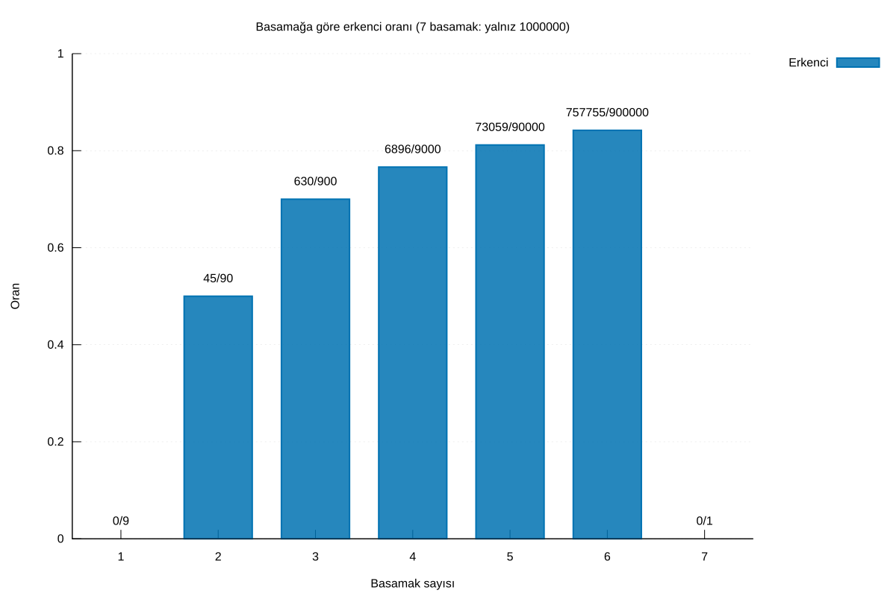

# Mahler Projesi

[English](README.md)

Ondalık Champernowne sabiti, diğer adıyla Mahler sayısı, üzerine C++20 ile geliştirilen matematik araştırma projesi:

```text
0.123456789101112131415...
```

C++ uygulaması doğrudan rakam sorgusu, erkencilik araması, yeniden üretilebilir CSV/JSON çıktıları, matematiksel analizler ve 1–1.000.000 aralığı için Ulam grafikleri sunar.

## Mevcut özellikler

- Önceki rakamları üretmeden pozitif `uint64_t` konumundaki rakamı bulma.
- JSON çıktısında kaynak sayıyı ve sayı içindeki sıfır tabanlı rakam ofsetini gösterme.
- Taşma denetimiyle pozitif sayının doğal başlangıç konumunu hesaplama.
- Sonraki doğrulama ve taramalar için C++ kütüphanesinden sınırlı önek üretme.
- Metin veya JSON sorgu çıktısı.
- `early` komutuyla ilk görünüm, erkencilik, erken frekans ve erkencilik mesafesi hesabı.
- Sayısal pencere taramasını bağımsız hedef başına yeniden kurma motoruyla karşılaştırma.
- Hedef özetlerini, isteğe bağlı erken konum kayıtlarını ve sağlama toplamlı çalışma manifestini dışa aktarma.
- Dosya yazımını çekirdek ölçümden ayırarak iki motorun süresini ölçme.
- Frekansları, özel sayı kümelerini, kaynak sınırı mekanizmalarını, döndürme tanıklarını ve sonlu rakam bloklarını analiz etme.

- Yedi Ulam katmanını küçük SVG veya isteğe bağlı libpng PNG olarak üretme.
- Gnuplot ile iki dilde SVG/PNG/PDF istatistik grafikleri oluşturma.

`inspect` yalnızca doğal konumu gösterir; erkencilik bilgileri için `early` kullanılır.

## macOS üzerinde çalıştırma

Gereksinimler: Xcode Command Line Tools veya Xcode, CMake 3.20 ve üzeri, C++20 derleyicisi. İlk desteklenen ortam macOS üzerinde Apple Clang'dir. Çekirdek hesaplama ve SVG spirali için Python, Gnuplot veya PNG kütüphanesi gerekmez. İsteğe bağlı PNG çıktısı libpng, istatistik çizimleri Gnuplot 6.x ve jq gerektirir.

Geliştirici araçlarını ve CMake'i kur. macOS'ta Homebrew pratik bir yoldur:

```sh
xcode-select --install
brew install cmake
```

Depoyu klonla, derle, test et ve ilk sorguyu çalıştır. `xcode-select` kurulumu bittiyse yeni bir Terminal penceresi açmak gerekebilir.

```sh
git clone https://github.com/erencankur/mahler-project.git
cd mahler-project
cmake -S . -B build -DCMAKE_BUILD_TYPE=Release
cmake --build build --parallel
ctest --test-dir build --output-on-failure
./build/mahler digit 2020
# 7
```

Geçerli komut sözleşmesi için `./build/mahler --help` çalıştır. Kaynak değişikliğinden sonra `cmake --build build --parallel` yeterlidir; CMake gerekirse kendi derleme dosyalarını yeniler. Temiz derleme için yalnız üretilen `build` dizinini sil:

```sh
rm -rf build
cmake -S . -B build -DCMAKE_BUILD_TYPE=Release
cmake --build build --parallel
```

Uygulamayı depo dışına kurmak için yazılabilir bir önek seç:

```sh
cmake --install build --prefix /tmp/mahler-install
/tmp/mahler-install/bin/mahler digit 2020
```

## Komutlar ve araştırma akışı

Tüm konumlar 1'den başlar ve baştaki `0.` sayılmaz. Her `<number>` ve `<position>` pozitif ondalık tam sayıdır. Erkencilik analizi bilinçli olarak 1.000.000 ile sınırlıdır.

| Komut | İşlevi |
| --- | --- |
| `digit <position>` | Önceki diziyi üretmeden ilgili konumdaki rakamı bulur. |
| `inspect <number>` | Sayının doğal başlangıcını bulur. |
| `early <number>` | İlk başlangıcı, erkenciliği, erken başlangıç sayısını ve mesafeyi verir. |
| `scan --max N --output FILE` | `1..N` içindeki her hedef için özet; isteğe bağlı olarak her erken görünüm kaydını yazar. |
| `legacy-csv --max N --output-dir DIR` | Eski listelerin yerine tüm erkenci ve asal-erkenci filtreli listeleri yazar. |
| `analyze --max N --output FILE` | Toplu matematik istatistiklerini JSON olarak yazar. |
| `plot-data --max N --output-dir DIR` | Grafikler için derlenmiş CSV tablolarını yazar. |
| `ulam --max N --layer NAME --output FILE` | Bir Ulam katmanını SVG olarak, grafik desteği varsa PNG olarak çizer. |
| `benchmark --max N` | Birincil veya bağımsız yeniden kurma motorunu ölçer. |

```sh
# Doğrudan sorgular: metin insan için, JSON programlar için uygundur.
./build/mahler digit 2020
# 7

./build/mahler digit 2020 --format json
# {"schema_version":1,"position":"2020","digit":7,"source_number":"710","digit_offset":0,"digit_count":3}

./build/mahler inspect 9910
# number: 9910
# digit_count: 4
# natural_position: 38530

./build/mahler inspect 9910 --format json
# {"schema_version":1,"number":"9910","digit_count":4,"natural_position":"38530"}

./build/mahler early 9910 --format json
# {"schema_version":1,"number":"9910","digit_count":4,"natural_position":"38530","first_position":"188","is_early":true,"early_frequency":4,"advance_digits":"38342"}

# Tam hedef tablosu ve erken görünüm tablosu.
./build/mahler scan --max 1000000 --format csv --output results/summary-1000000.csv --occurrences results/occurrences-1000000.csv
./build/mahler scan --max 1000000 --format json --output results/summary-1000000.json

# Eski listeye uyumlu çıktılar: tüm erkenciler ve asal alt kümesi.
./build/mahler legacy-csv --max 1000000 --output-dir results/legacy-compatible

# Özet analizler ve grafik kaynak tabloları.
./build/mahler benchmark --max 1000000 --engine window --repeat 3
./build/mahler analyze --max 1000000 --output results/analysis-1000000.json
./build/mahler ulam --max 25 --layer combined --cell-size 16 --output results/ulam-25.svg
./build/mahler plot-data --max 1000000 --output-dir results/plot-data

./build/mahler --help
./build/mahler --version
```

Konumlar 1'den başlar; baştaki `0.` sayılmaz. JSON'da konumlar ve hedef/kaynak sayılar, JavaScript gibi tüketicilerde hassasiyet kaybını önlemek için ondalık metin olarak yazılır. Rakam, ofset, basamak sayısı ve şema sürümü JSON sayısıdır.

### CSV ve JSON dosyaları

Deney çıktıları için `results/` altında çalış; dizin Git tarafından yok sayılır, böylece milyon-hedeflik dosyalar kaynak commit'lerine girmez. `scan`, `--manifest` ile başka yol verilmezse özetin yanına manifest yazar. Manifest aralığı, makine/derleme bağlamını, kayıt adetlerini, süreleri ve FNV-1a-64 sağlama toplamlarını içerir.

| Çıktı | `--max 1000000` satır adedi | Kullanım |
| --- | ---: | --- |
| `summary-1000000.csv` | 1.000.000 | Erkenci olmayanlar dahil hedef düzeyindeki tam tablo. |
| `occurrences-1000000.csv` | 2.688.255 | Her erken başlangıç ve kaynak-sınır bilgisi. |
| `legacy-compatible/early-birds.csv` | 838.385 | Hedef sırasıyla tüm erkenci sayılar. |
| `legacy-compatible/prime-early-birds.csv` | 66.388 | Hedef sırasıyla asal erkenci sayılar. |
| `analysis-1000000.json` | tek JSON belgesi | Frekans, asal, mekanizma ve sonlu blok özetleri. |
| `plot-data/*.csv` | on derlenmiş tablo | İstatistik grafiklerinin yeniden üretilebilir girdileri. |

İki eski-liste-uyumlu CSV şu sütunları kullanır: `number,digit_count,first_position,natural_position,early_frequency,advance_digits`. Her satır erkencidir; `early_frequency`, örtüşmeler dahil doğal konumdan önceki farklı başlangıçları sayar. `manifest.json` iki dosyayı da denetler. Küçük örnek ve alan tanımları için tam [CSV dışa aktarma rehberine](docs/LEGACY_CSV_EXPORTS.md) bak.

Tam çıktıyı bağımsız denetlemek için özet ve görünüm dosyalarından sonra verilen standart kitaplık betiğini çalıştır:

```sh
python3 scripts/verify_exports.py \
  --summary results/summary-1000000.csv \
  --occurrences results/occurrences-1000000.csv
```

## Doğrulama

Çekirdek kontrolleri 10.000'e kadar bağımsız oluşturulmuş öneği, büyük konumları ve taşmaları kapsar. Erkencilik kontrolleri 9.999'a kadar bütün erken konumları doğrudan metin aramasıyla, bir milyona kadar her hedefin ilk konumunu ve frekansını iki C++ motoruyla karşılaştırır; seçili elde örnekleri ayrıca bağımsız aranır. Bir milyonluk taramada **838.385** erkenci sayı ve **2.688.255** erken konum bulundu. Toplu çıktı testleri şemaları, tekrarları ve hatalı seçenekleri sınar. İsteğe bağlı [çıktı doğrulayıcısı](scripts/verify_exports.py) tam CSV/JSON dosyalarını ve her konumu dizi metnine karşı denetler. Sonuçlar ve ölçümler [Faz 3 raporunda](docs/PHASE3_REPORT.md).

[Faz 4 analizi](docs/PHASE4_REPORT.md), frekansları, asal ve özel sayı kümelerinin paydalarını, sınır mekanizmalarını ve sonlu blok istatistiklerini açıklar. [Faz 5](docs/PHASE5_REPORT.md), bir milyon koordinatın denetimini, PNG piksel kontrollerini, özet doğrulamasını ve grafikleri ekler.

## Grafikler




Mavi: yalnız erkenci; turuncu: yalnız asal; yeşil: ikisi birden; açık gri: hiçbiri; koyu gri: 1–1.000.000 dışında. Spiral merkezde 1 ile başlar, sağa ve sonra yukarı ilerler. **66.388** sayı hem asal hem erkencidir. Ölçekler, kaynak tabloları ve yedi katman için [grafik kataloğuna](figures/README.md) bakabilirsin.

```sh
# İsteğe bağlı tam grafik derlemesi ve yeniden üretim
brew install libpng gnuplot jq
cmake -S . -B build -DCMAKE_BUILD_TYPE=Release -DMAHLER_ENABLE_GRAPHICS=ON
cmake --build build --parallel
bash scripts/render_figures.sh
```

Tam çıktılar Git dışında `results/figures/` altında, seçilmiş görseller ve küçük kaynak tabloları depoda tutulur. Üretim için Python gerekmez.

Apple Clang ile ek bellek ve aritmetik kontrolleri:

```sh
cmake -S . -B build-sanitize -DCMAKE_BUILD_TYPE=Debug -DMAHLER_ENABLE_SANITIZERS=ON
cmake --build build-sanitize --parallel
ctest --test-dir build-sanitize --output-on-failure
```

## Matematik ve geliştirme planı

- [Matematiksel tanımlar ve API sözleşmesi](docs/tr/SPECIFICATION.md)
- [İki dilli yol haritası, araştırma kaynakları ve grafik kararları](ROADMAP.md)
- [Faz 2 doğrulaması ve eski listelerin karşılaştırması](docs/PHASE2_REPORT.md)
- [Faz 3 veri seti, sağlama toplamları ve ölçümleri](docs/PHASE3_REPORT.md)
- [Faz 4 matematiksel analiz ve örnekler](docs/PHASE4_REPORT.md)
- [Faz 5 grafikler, geometri, algoritmalar ve yorum](docs/PHASE5_REPORT.md)
- [Katkı rehberi](CONTRIBUTING.md)
- [Sürüm notları](CHANGELOG.md)
- [OEIS A033307: Champernowne rakamları](https://oeis.org/A033307)
- [OEIS A117804: doğal konumlar](https://oeis.org/A117804)
- [OEIS A116700: erkenci sayılar](https://oeis.org/A116700)

Eski matematik çalışması kardeş `../legacy-math-folders/` dizininde korunur. Uygulama çalışırken bu arşive ihtiyaç duymaz ve arşivi değiştirmez.

## Sürüm ve lisans durumu

Mahler Project `v0.1.0`, [MIT Lisansı](LICENSE) ile yayınlanır. Etiketli yayın [GitHub'da](https://github.com/erencankur/mahler-project/releases/tag/v0.1.0) bulunur.
